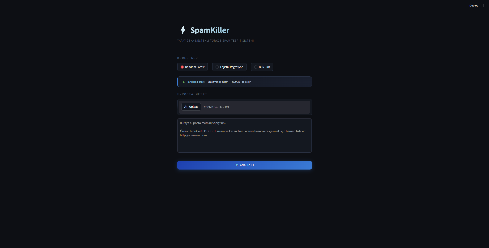
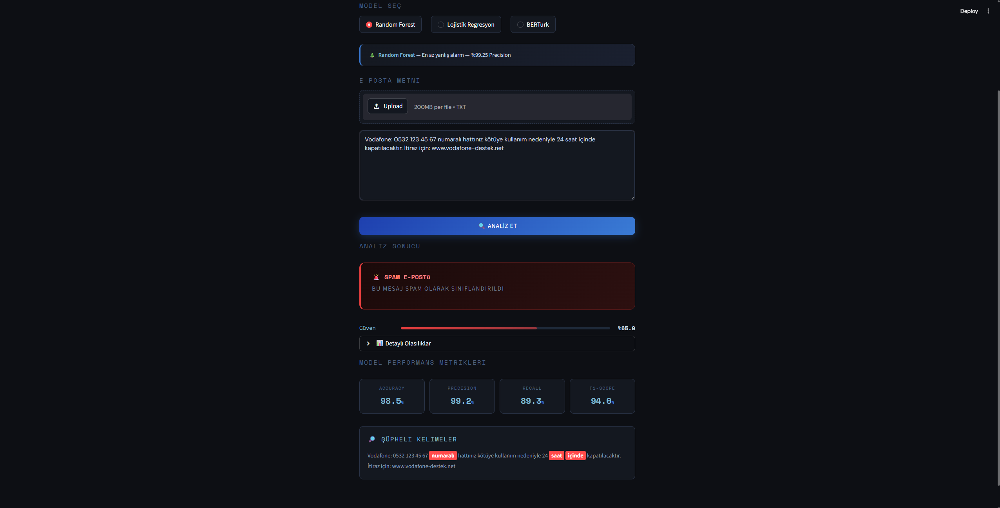
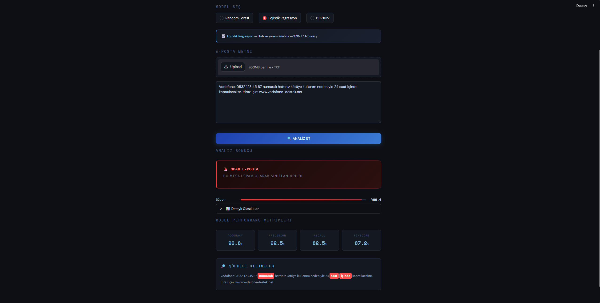
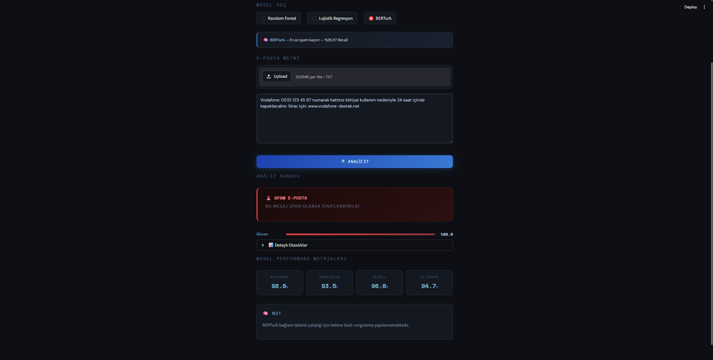

# SpamKiller

Türkçe e-postaları gerçek zamanlı olarak analiz eden,üç farklı makine öğrenmesi modeli destekli spam tespit sistemi.

---

## Dosya Yapısı
 
```
SpamKiller/
├── data/
│   ├── SMSSpamCollection       # Ham İngilizce veri seti
│   └── spam_islenmis.csv       # Türkçeye çevrilmiş ve temizlenmiş veri
├── ekran_goruntuleri/          
├── models/
│   ├── rf_model.pkl            # Eğitilmiş Random Forest modeli
│   ├── lr_model.pkl            # Eğitilmiş Lojistik Regresyon modeli
│   ├── tfidf.pkl               # Eğitilmiş TF-IDF vektörleyici
│   └── berturk_model/          # Fine-tune edilmiş BERTurk ağırlıkları
├── notebooks/
│   ├── 01_veri_inceleme.ipynb  # Veri keşfi ve istatistikler
│   ├── 02_on_isleme.ipynb      # Temizleme ve özellik çıkarımı
│   ├── 03_model_egitimi.ipynb  # RF ve LR eğitimi
│   ├── 04_berturk.ipynb        # BERTurk fine-tuning
│   └── 05_karsilastirma.ipynb  # Model karşılaştırması
├── src/
│   ├── preprocessor.py         # TextPreprocessor sınıfı
│   ├── model_loader.py         # ModelLoader sınıfı
│   ├── predictor.py            # SpamPredictor sınıfı
│   └── ui.py                   # SpamKillerUI sınıfı
├── app.py                      # Uygulama giriş noktası
├── requirements.txt
└── README.md
```
 
---

## Veri Seti

Projede **SMS Spam Collection Dataset** İngilizce kaynaklı,yaklaşık 5000 metinden oluşan veri seti kullanılmış olup bu metinler **spam_islenmis.csv** adındaki dosyayla Türkçeye çevrilmiştir.

---

## Ön İşleme

Ham metinler modele verilmeden önce şu adımlardan geçirilmektedir:

- Tüm karakterler küçük harfe dönüştürülür.
- URL'ler `[URL]`, e-posta adresleri `[EMAIL]`, sayılar `[SAYI]` token'larıyla değiştirilir;bu sayede model bu yapıları içerik yerine yapısal sinyal olarak öğrenir.
- Noktalama işaretleri kaldırılır.
- Türkçe stopword'ler çıkarılır (ve, ile, bir, için vb.).

---

## Modeller

Üç model de eğitim verisinin %80'i ile eğitilmiş,%20'si ile test edilmiştir.
 
**Random Forest**,100 karar ağacının oylamasıyla karar verir.Her ağaç rastgele örnekleme ve özellik seçimiyle bağımsız karar üretir;tahmin bu ağaçların çoğunluk oyuyla belirlenir.
 
**Lojistik Regresyon**,her kelimenin spam kararına ne kadar katkı sağladığını bir ağırlıkla öğrenir.
 
**BERTurk**,Türkçe metin üzerinde önceden eğitilmiş `dbmdz/bert-base-turkish-cased` modelinin spam verimiz üzerine fine-tune edilmiş halidir.BERT ailesi modeller,bir kelimeyi solundaki ve sağındaki bağlamla birlikte değerlendiren transformer mimarisini kullanır.Bu sayede aynı kelimenin farklı cümlelerde farklı anlam taşıdığını öğrenebilir.Modeli Hugging Face üzerinde yayınladım:[enesmidesem/spamkiller-berturk](https://huggingface.co/enesmidesem/spamkiller-berturk).

Klasik modeller(Random Forest ve Lojistik Regresyon),kelime frekansına dayandığından belirgin spam kalıpları içermeyen metinlerde yetersiz kalabilir.Her üç model de kısa SMS formatında eğitildiğinden uzun e-postalarda performans düşebilir.

---

## Şüpheli Kelime Tespiti

Klasik modellerde spam kararına en çok katkı sağlayan ilk 5 kelime arayüzde vurgulanır.Random Forest'ta `feature_importances_`,Lojistik Regresyon'da `coef_` değerleri kullanılır.BERTurk bağlamsal çalıştığından kelime bazlı vurgulama yapılamamaktadır.

---

## Model Performansı

| Model | Accuracy | Precision | Recall | F1-Score |
|---|---|---|---|---|
| Random Forest | %98.47 | %99.25 | %89.26 | %93.99 |
| Lojistik Regresyon | %96.77 | %92.48 | %82.55 | %87.23 |
| BERTurk | %98.56 | %93.46 | %95.97 | %94.70 |

**Precision** — Spam olarak işaretlenen mesajların ne kadarının gerçekten spam olduğunu gösterir.

**Recall** — Gerçek spam mesajlarının ne kadarının yakalandığını gösterir.

Test Sonuçlarına göre Random Forest en yüksek Precision'ı elde ederken,BERTurk en yüksek Recall'ı elde etmiştir.

---

## Ekran Görüntüleri
 
| Ana Ekran | Random Forest | Lojistik Regresyon | BERTurk |
|---|---|---|---|
| [](ekran_goruntuleri/ana_ekran.png) | [](ekran_goruntuleri/randomForest.png) | [](ekran_goruntuleri/logisticRegression.png) | [](ekran_goruntuleri/BERTurk.png) |
 
---
 
## Demo Videosu
 
[](https://www.youtube.com/watch?v=PSGAgnddK4E)
 

